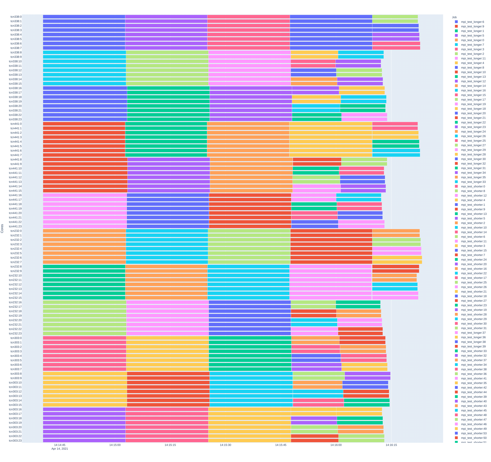
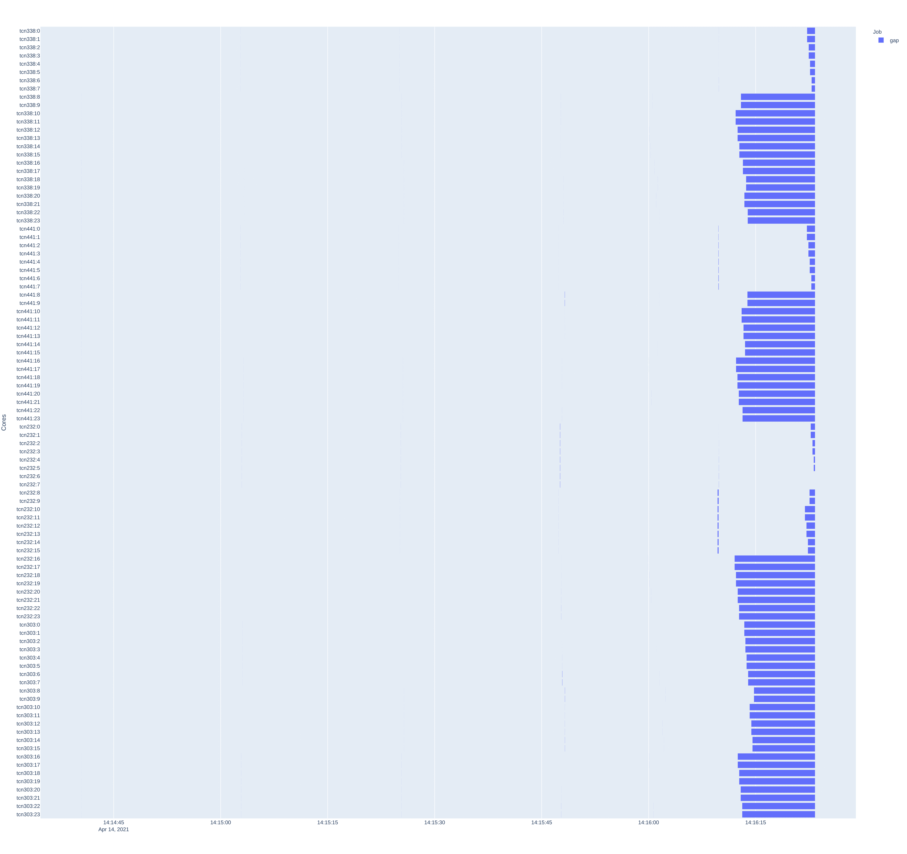

Performance statistics
======================

The QCG-PilotJob service provides tools which, based on service logs, allow you
to analyse the efficiency of resource use. Please note that the current
implementation is the first version of these tools and may not be free from
errors.

Performance measurements and data collection
--------------------------------------------

Due to the potential load on the QCG-PilotJob service and its asynchronous
nature, in order to accurately measure its performance it is necessary to use
external metrics to determine when a particular job started and ended. In order
to generate such metrics, a wrapper program was created in the C language. The
role of this program is to register the moment when the application indicated
by the arguments started, and to register the moment when it ended. The
collected data is sent through a named pipe (data sent through such a
communication channel is not stored in the file system, so the file system
performance does not affect the efficiency of communication) to the
QCG-PilotJob service agent running on the local compute node. When all
calculations are completed, the collected data are written to the QCG-PilotJob
service logs.

Note that currently all parallel tasks (requiring more than one
core) are started using the "srun" command (provided by the Slurm queue
system). Therefore, the wrapper used with the "srun" command will register the
moment the "srun" command itself is run, and not the target processes of the
parallel application. Therefore, please note that the metrics and analysis
presented here do not take into account the latency of the queueing system
itself

Wrapper installation
^^^^^^^^^^^^^^^^^^^^

As the wrapper itself is written in C, it requires compilation on the target
computing cluster. 

Source code (``qcg_pj_launch_wrapper.c``) can be downloaded from the **develop** branch of QCG-PilotJob project repository on
GitHub_, e.g:

.. code:: bash

    $ wget https://raw.githubusercontent.com/vecma-project/QCG-PilotJob/develop/utils/qcg_pj_launch_wrapper.c 

and then compiled using the compiler of your choice:

.. code:: bash

    $ gcc -Wall -o qcg_pj_launch_wrapper qcg_pj_launch_wrapper

or

.. code:: bash

    $ icc -Wall -o qcg_pj_launch_wrapper qcg_pj_launch_wrapper

The compiled program should be placed in a path accessible from all compute nodes. 

Launch of QCG-PilotJob service with collection of external metrics
^^^^^^^^^^^^^^^^^^^^^^^^^^^^^^^^^^^^^^^^^^^^^^^^^^^^^^^^^^^^^^^^^^

In order to collect external metrics related to application execution time, two
arguments must be passed when starting the QCG-PilotJob service:

- ``--enable-rt-stats`` - enabling the collection of statistics
- ``--wrapper-rt-stats`` - indication of wrapper location (the path to the installed wrapper program)

An example call to the QCG-PilotJob service with the job description placed in
a JSON file and the collection of external metrics looks like this:

.. code:: bash

    $ qcg-pm-service --wd out-dir --file-path mpi_iter_mixed.json --enable-rt-stats --wrapper-rt-stats /home/piotrk/runtime_wrapper/qcg_pj_launch_wrapper 

In this case, all logs and metrics will be in the 'out-dir' subdirectory when
the calculation is complete.

Analysis tool - qcg-pm-report
-----------------------------

The QCG-PilotJob package provides a qcg-pm-report program to enable performing
a number of analyses based on the data collected by the wrapper and available
in a working directory after the QCG-PilotJob's run. It allows to assess the
performance of the entire workflow, elementary tasks as well as to get
information about resources utilisation. 

A description of the available commands of qcg-pm-report is given below.

stats
^^^^^

The stats command displays basic metrics about the executed workflow as a
whole, such as:

- ``total jobs``, ``failed jobs`` - number of running jobs and number of failed jobs
- ``total cores``, ``total nodes`` - number of available nodes and total number of available cores on all nodes
- ``service started``, ``service finished``, ``service runtime`` - the start and end time of the QCG-PilotJob service and the difference between these dates; note that the start time of the QCG-PilotJob service may be slightly delayed with respect to the start time of the job in the Slurm service, as the time reported by the queue system does not take into account the time associated with loading the Python environment and the QCG-PilotJob service modules; in practice, however, this difference should not be greater than 1-2 seconds.
- ``init overhead``, ``finish overhead``, ``total overhead`` - these are respectively the time markups for the initiation of the QCG-PilotJob service (the time from the start of the service to the start of the first job within it), the finish time of the QCG-PilotJob service (the time from the end of the last job within it to the end of the QCG-PilotJob service) and the sum of the two previously mentioned
- ``overhead ratio`` - the ratio of ``total overhead`` to ``service runtime``
- ``overhead core-hours`` - it is a product of available cores and ``total overhead`` value (expressed in hours)

An example of a generated report:

.. code:: bash

	$ qcg-pm-report stats out/intelmpi-mpi-iter-mixed-large-10128902/
					   total jobs: 2000
					  failed jobs: 0
					  total cores: 960
					  total nodes: 40
				  service started: 2021-04-14 14:20:08.223523
				 service finished: 2021-04-14 14:23:21.028799
				  service runtime: 192.81 secs
					init overhead: 4.08 secs
				  finish overhead: 1.57 secs
				   total overhead: 5.65 secs
				   overhead ratio: 2.9
			  overhead core-hours: 1.51

launch-stats
^^^^^^^^^^^^

The launch-stats command is used to generate a report showing delays in
launching and recording the completion of jobs by the QCG-PilotJob service. The
following metrics are generated:

- ``total start overhead`` - total (for all jobs) time difference between starting the job by the QCG-PilotJob service and the actual start of the job (information registered by the running wrapper), expressed in seconds
- ``total finish overhead`` - total (for all jobs) difference in time between the actual finish of the job (information registered by the running wrapper) and the moment when it was registered by the QCG-PilotJob service, expressed in seconds
- ``total start and finish overhead`` - sum of the two previous metrics
- ``average job start overhead`` - average delay in starting a single job
- ``average job finish overhead`` - average delay in handling the completion of a single job
- ``average job total overhead`` - average total delay in starting and handling the completion of a single job
- ``average real job run time`` - average real run time of a single job (determined by metrics sent by wrapper)
- ``average qcg job run time`` - average duration of a single job (determined from the times recorded by the QCG-PilotJob service)
- ``average job overhead per runtime`` - percentage ratio of ``average job total overhead`` to the ``average real job run time``
- ``generated for total jobs`` - the number of jobs for which a report was generated, i.e. the number of all jobs for which metrics were recorded (these were provided by the wrapper

An example of a generated report:

.. code:: bash

	$ qcg-pm-report launch-stats out/intelmpi-mpi-iter-mixed-large-10128902/
								 total start overhead: 29.2834
								total finish overhead: 62.1390
					  total start and finish overhead: 91.4224
						   average job start overhead: 0.0146
						  average job finish overhead: 0.0311
						   average job total overhead: 0.0457
							average real job run time: 16.5664
							 average qcg job run time: 16.6121
				 average job overhead per runtime (%): 0.29
							 generated for total jobs: 2000

gantt
^^^^^

The ``gantt`` command is used to generate a timeline plot with the start and end
of each task running on the allocated resources marked. This plot shows an
overall view of the scheduling plan. In order to generate the plot, as an
additional argument, in addition to the path to the working directory of the
task, the name of the target file where the plot should be saved should be
given. Supported files include: pdf, png, jpeg.  Note - the time to generate
the graph depends on the number of resources, the number of tasks and the
duration of the entire workflow, and for larger scenarios can be a
time-consuming operation. In case of a scenario running 2000 tasks on 960 cores
and 40 nodes, the graph generation may take up to 3 minutes.

Example of chart generation:

.. code:: bash

	$ qcg-pm-report gantt out/intelmpi-mpi-iter-mixed-10128873/ gantt.pdf

A sample chart generated:

gantt-gaps
^^^^^^^^^^

The ``gantt-gaps`` command is used to generate a timeline plot with marked
moments when resources were not used. This plot is in a way the negative of the
plot generated by the "gantt" command. As an additional argument, in addition
to the path to the working directory of the task, you should give the name of
the target file where the plot should be saved. The following files are
supported: pdf, png, jpeg.  Note - the time to generate the graph depends on
the number of resources, the number of tasks and the duration of the entire
workflow, and for larger scenarios can be a time-consuming operation. In the
case of a scenario running 2000 tasks on 960 cores and 40 nodes, graph
generation can take up to 3 minutes.

Example of chart generation:

.. code:: bash

	$ qcg-pm-report gantt-gaps out/intelmpi-mpi-iter-mixed-10128873/ gantt-gaps.pdf

A sample chart generated:

rusage
^^^^^^

The ``rusage`` command is used to generate a report showing the usage of available resources. In the basic version, it displays two metrics:

- ``used cores`` - number of cores on which tasks were running
- ``average core utilization (%)`` - percentage core utilization, it is calculated as the average value of the percentage utilization of a single core (on which at least one task was running)

The single core utilisation percentage is calculated as the ratio of the time
during which a job was actually running on a given node (based on metrics sent
by the wrapper) to the total time of running the QCG-PilotJob service (see
``service runtime`` in the ``stats`` command).

An example of a generated report:

.. code:: bash

	$ qcg-pm-report rusage out/intelmpi-mpi-iter-mixed-large-10128902/
                                       used cores: 960
                     average core utilization (%): 94.2%

Running the ``rusage`` command with the ``--details`` parameter will list the
usage percentages for each core.

For example, a generated report containing details:

.. code:: bash

	$ qcg-pm-report rusage --details out/intelmpi-mpi-iter-mixed-large-10128902/
                                       used cores: 960
                     average core utilization (%): 94.2%
         tcn1261
                 0    : 95.9%, unused 7.8734 s
                 1    : 95.9%, unused 7.8734 s
                 2    : 96.1%, unused 7.4926 s
                 3    : 96.1%, unused 7.4926 s
                 4    : 96.2%, unused 7.3733 s
                 5    : 96.2%, unused 7.3733 s
                 6    : 90.0%, unused 19.3723 s
                 7    : 90.0%, unused 19.3723 s
                 8    : 90.4%, unused 18.5259 s
                 9    : 90.4%, unused 18.5259 s
                 10 : 90.1%, unused 19.0094 s
                 11 : 90.1%, unused 19.0094 s
                 12 : 90.3%, unused 18.7818 s
                 13 : 90.3%, unused 18.7818 s
                 14 : 90.3%, unused 18.7562 s
                 15 : 90.3%, unused 18.7562 s
                 16 : 95.4%, unused 8.8197 s
                 17 : 95.4%, unused 8.8197 s
                 18 : 95.5%, unused 8.6833 s
                 19 : 95.5%, unused 8.6833 s
                 20 : 95.6%, unused 8.5297 s
                 21 : 95.6%, unused 8.5297 s
                 22 : 95.8%, unused 8.0063 s
                 23 : 95.8%, unused 8.0063 s

(due to the length of the report, data for one computational node only are included).

efficiency
^^^^^^^^^^

Command ``efficiency`` is used to show the percentage of resource usage,
excluding the time when the resource was inactive due to a scheduling plan.
Resource usage time is counted as time when any task was running or when
another task was waiting for another resource to free up. The efficiency metric
only takes into account delays due to QCG-PilotJob's job launching and
termination handling.

An example of a generated report:

.. code:: bash

	$ qcg-pm-report efficiency out/intelmpi-mpi-iter-mixed-large-10128902/
                               used cores: 960
             average core utilization (%): 99.6%

.. _Github: https://github.com/vecma-project/QCG-PilotJob/tree/develop/
